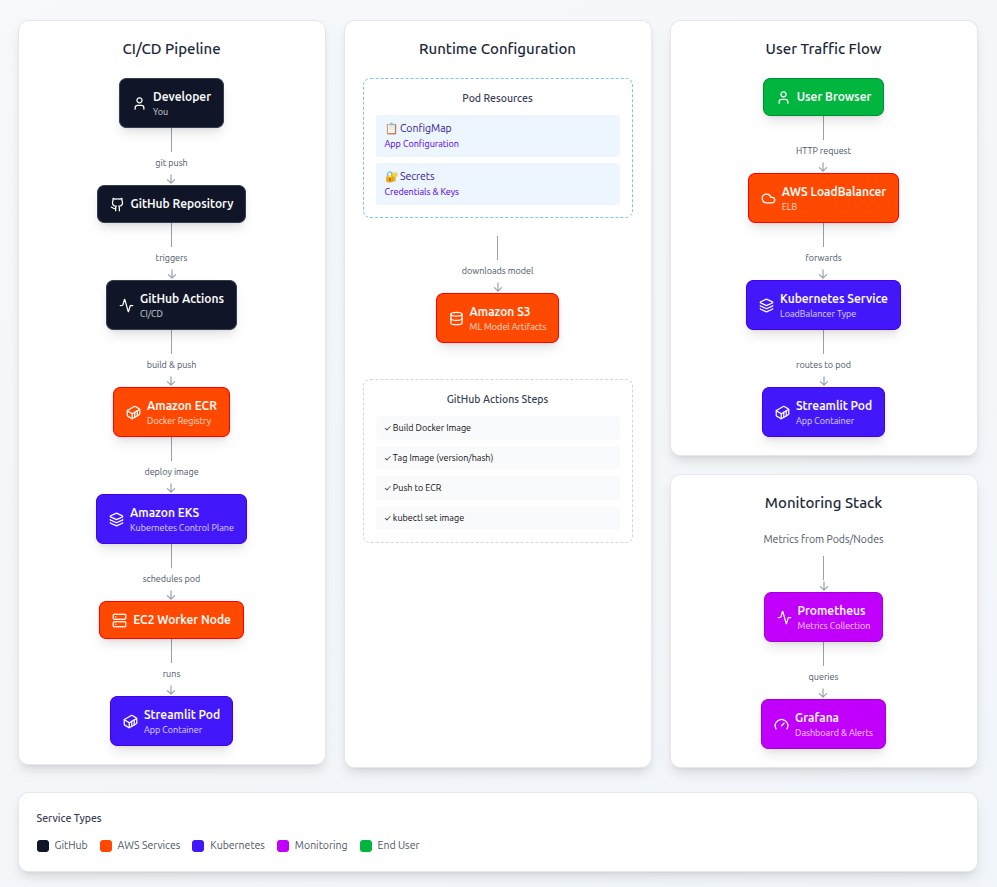
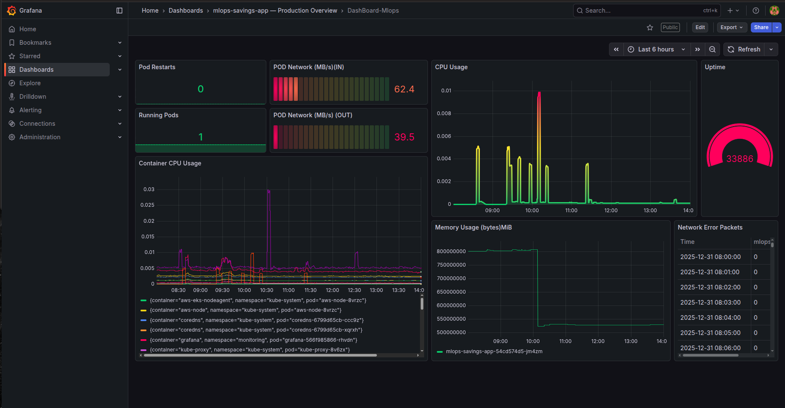
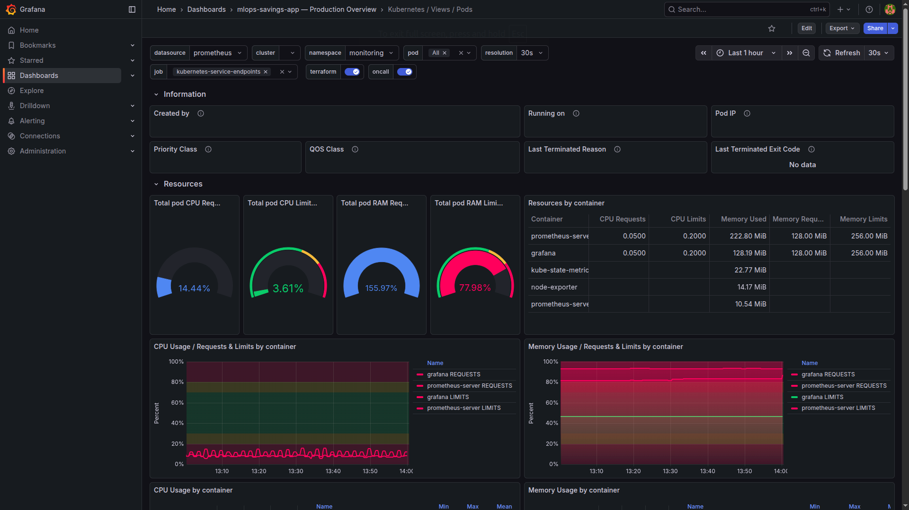
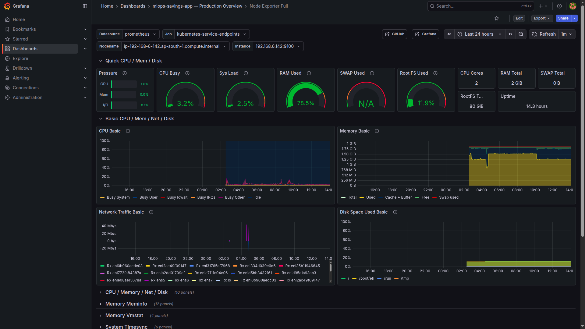

# MLOps Savings Prediction System

This project implements an end-to-end MLOps pipeline for deploying a machine learning–based savings prediction application 
in a cloud-native environment. The system uses a Streamlit web application for inference, containerized with Docker, deployed 
on Kubernetes using AWS EKS, and automated through a CI/CD pipeline built with GitHub Actions. Machine learning model artifacts 
are stored separately in Amazon S3, container images are managed in Amazon ECR, and the application is exposed via a Kubernetes
LoadBalancer. The project demonstrates real-world MLOps practices including model–code separation, automated deployments, 
Kubernetes orchestration, monitoring with Prometheus and Grafana, and cloud cost awareness.

[Instruction for implementation](instruction.md)
## Tech Stack

### Cloud & Infrastructure
- Amazon Web Services (AWS)
- Amazon EKS (Elastic Kubernetes Service)
- Amazon EC2 (Worker Nodes)
- Amazon S3 (Model Artifact Storage)
- Amazon ECR (Container Registry)

### Containerization & Orchestration
- Docker
- Kubernetes

### CI/CD
- GitHub Actions

### Monitoring & Observability
- Prometheus
- Grafana

### Application & Machine Learning
- Python
- Streamlit
- scikit-learn
- joblib

## Architecture Overview

The system follows a cloud-native, microservices-oriented architecture where the machine learning application is containerized and orchestrated using Kubernetes on AWS. The application code, model artifacts, and infrastructure are decoupled to enable independent development, deployment, and scaling.

The Streamlit-based ML application is packaged as a Docker image and stored in Amazon ECR. Kubernetes, managed via Amazon EKS, pulls this image and schedules the application pod onto EC2 worker nodes. Model artifacts are stored separately in Amazon S3 and are downloaded by the application at runtime. Public access to the application is provided through a Kubernetes Service of type LoadBalancer, which provisions an AWS Elastic Load Balancer automatically.

Continuous integration and deployment are handled by GitHub Actions, which builds and pushes Docker images to ECR and updates the Kubernetes Deployment. Monitoring and observability are achieved using Prometheus for metrics collection and Grafana for visualization, both running within the same Kubernetes cluster.

## Architecture Diagram

The diagram illustrates the end-to-end workflow of the system, including CI/CD, container registry, Kubernetes orchestration, application runtime, model artifact storage, and monitoring components.

## How It Works

This project demonstrates a complete end-to-end MLOps workflow, covering model serving, containerization, orchestration, CI/CD, and monitoring on AWS.

### 1. Model Artifact Management (AWS S3)

- Trained machine learning artifacts (`.joblib` model and `.pkl` feature schema) are not stored in GitHub due to size limitations.
- These artifacts are uploaded to an AWS S3 bucket and treated as external, versioned assets.
- At application startup, the system checks whether the model files exist locally.
- If the files are missing, they are downloaded from S3 before being loaded into memory.

This keeps the repository lightweight and ensures stateless containers.

---

### 2. Application Layer (Streamlit)

- The inference service is built using Streamlit.
- It loads the trained Random Forest model and performs real-time predictions based on user inputs.
- Environment-specific values (bucket name, region, model version) are injected via Kubernetes ConfigMaps and Secrets.
- No secrets or credentials are hardcoded in the source code.

---

### 3. Containerization (Docker)

- The application is packaged into a Docker image.
- The image contains only application code and dependencies.
- Model artifacts are intentionally excluded from the image and fetched dynamically from S3 at runtime.
- This reduces image size and avoids unnecessary rebuilds when models change.

---

### 4. Container Registry (Amazon ECR)

- Docker images are pushed to Amazon Elastic Container Registry (ECR).
- Each image is tagged using a unique identifier (commit hash).
- ECR acts only as an image registry and does not run containers.

---

### 5. CI/CD Pipeline (GitHub Actions)

- GitHub Actions automates the deployment workflow.
- On every push to the main branch:
  - The Docker image is built
  - The image is pushed to ECR
  - The Kubernetes Deployment is updated with the new image tag
- AWS credentials are stored securely using GitHub Secrets.

This enables fully automated and repeatable deployments.

---

### 6. Orchestration (Amazon EKS + Kubernetes)

- Amazon EKS manages the Kubernetes control plane.
- Worker nodes are EC2 instances created as a managed node group.
- Kubernetes handles pod scheduling, restarts, and rolling updates.
- A Deployment ensures the desired number of application pods are always running.
- A Service of type LoadBalancer exposes the application publicly using an AWS Elastic Load Balancer.

---

### 7. Monitoring (Prometheus and Grafana)

- Prometheus collects cluster and application-level metrics such as pod status, node health, and resource usage.
- Grafana visualizes these metrics through dashboards.
- Monitoring components run in a separate Kubernetes namespace for isolation.

---

### 8. External Access

- The application is accessed through an AWS-managed Elastic Load Balancer.
- AWS automatically assigns a public DNS endpoint.
- No custom domain is required for access.
- Anyone with the endpoint URL can access the deployed application.

---

### Design Principles

- Stateless containers
- Externalized configuration and secrets
- Separation of code, model, and infrastructure
- Automated CI/CD pipeline
- Cloud-native monitoring

## Monitoring and Observability

This project uses Prometheus for metrics collection and Grafana for visualization. The dashboards focus only on application and infrastructure health relevant to the deployed ML service.

---

### Dashboard 1: Application Resource Overview

This dashboard provides a high-level overview of the deployed application, excluding monitoring system components such as Prometheus and Grafana.

Metrics shown:
- CPU usage of application pods
- Memory usage of application pods
- Network throughput (ingress and egress)
- Network error packets
- Number of running application pods (`mlops-savings-app`)
- Application uptime

This dashboard is used to quickly assess the overall health and stability of the ML inference service.

---

### Dashboard 2: Kubernetes Pods

This dashboard focuses on Kubernetes pod-level details.

Metrics shown:
- Pod status (Running, Pending, Failed)
- Pod restarts
- Pod resource consumption
- Namespace-level pod visibility

It helps in debugging deployment issues, rollout behavior, and pod scheduling problems.

---

### Dashboard 3: Node Exporter Metrics

This dashboard visualizes metrics collected from Kubernetes worker nodes using Node Exporter.

Metrics shown:
- Node CPU utilization
- Node memory usage
- Disk I/O and filesystem usage
- Network traffic at node level
- Node uptime

This dashboard is useful for identifying infrastructure-level bottlenecks and understanding node resource pressure.

## CI/CD Pipeline

This project uses GitHub Actions to implement a continuous integration and continuous deployment (CI/CD) pipeline for automated container build and deployment to Kubernetes on AWS.

---

### CI/CD Tooling

- GitHub Actions – pipeline orchestration
- Docker – container build
- Amazon ECR – container image registry
- Amazon EKS – Kubernetes cluster
- kubectl – deployment updates

---

### Pipeline Workflow

The CI/CD pipeline is triggered automatically on every push to the `main` branch.

#### Step 1: Source Code Trigger
- A commit or push to the `main` branch initiates the pipeline.
- GitHub Actions runner checks out the latest source code.

---

#### Step 2: Docker Image Build
- The application is built into a Docker image.
- The image contains:
  - Streamlit application code
  - Python dependencies
  - Runtime logic to fetch model artifacts from S3
- Model files are not included in the image.

---

#### Step 3: Push Image to Amazon ECR
- The Docker image is tagged using the Git commit hash.
- The image is pushed to Amazon Elastic Container Registry (ECR).
- ECR serves as a centralized registry for versioned container images.

---

#### Step 4: Update Kubernetes Deployment
- The pipeline updates the Kubernetes Deployment image reference using `kubectl set image`.
- Kubernetes performs a rolling update:
  - Old pods are terminated gradually
  - New pods are created with the updated image
- Zero-downtime deployment is maintained.

---

#### Step 5: Deployment Verification
- The pipeline waits for the rollout to complete.
- If pods fail to schedule or start, the pipeline fails.
- Successful rollout confirms the deployment is live.

---

### Secrets Management in CI/CD

- AWS credentials are stored securely as GitHub Secrets.
- Kubernetes Secrets and ConfigMaps are not stored in the repository.
- Sensitive information is injected at runtime.

---

### CI/CD Design Principles

- Fully automated deployment
- Immutable container images
- No manual SSH or server access
- Reproducible and auditable releases
- Environment-agnostic pipeline logic

---

### Outcome

Any change merged into the `main` branch is automatically built, pushed, and deployed to the Kubernetes cluster, ensuring fast and consistent delivery of updates.

## Kubernetes Resources

The application is deployed and managed using Kubernetes resources on Amazon EKS. Each resource has a clearly defined responsibility in the system.

---

### Deployment

- The application runs as a Kubernetes Deployment.
- The Deployment ensures the desired number of application pods are always running.
- Rolling updates are used to deploy new application versions without downtime.
- Each deployment update creates a new ReplicaSet, which explains the presence of multiple historical pods in monitoring metrics.

Key responsibilities:
- Pod lifecycle management
- Rolling updates
- Self-healing (automatic restarts)

---

### Service

- A Kubernetes Service of type `LoadBalancer` is used.
- The Service exposes the application externally.
- AWS automatically provisions an Elastic Load Balancer (ELB) for public access.
- The Service routes incoming traffic to healthy application pods.

Key responsibilities:
- Stable networking endpoint
- Load distribution across pods
- External access to the application

---

### ConfigMap

- ConfigMaps are used to store non-sensitive configuration values.
- Examples include:
  - AWS region
  - S3 bucket name
  - Model version identifiers
- These values are injected into the application as environment variables.

Key responsibilities:
- Environment-specific configuration
- Decoupling configuration from application code

---

### Secret

- Kubernetes Secrets store sensitive information.
- Examples include:
  - AWS access key ID
  - AWS secret access key
- Secrets are mounted as environment variables at runtime.
- Secret manifests are excluded from version control.

Key responsibilities:
- Secure credential management
- Preventing hardcoded secrets in code or images

---

### Namespace Usage

- The application runs in the default namespace.
- Monitoring components (Prometheus and Grafana) run in a separate `monitoring` namespace.
- This separation improves isolation and operational clarity.

---

### Resource Interaction Summary

- Deployment manages application pods.
- Service exposes the pods externally via AWS ELB.
- ConfigMap provides runtime configuration.
- Secret provides secure credentials.
- Kubernetes orchestrates scheduling, scaling, and recovery automatically.

## Conclusion

This project demonstrates a complete, production-oriented MLOps deployment pipeline on AWS. It covers the full lifecycle of a machine learning application, from model storage and containerization to automated deployment, orchestration, and monitoring.

The system is designed using cloud-native principles:
- Stateless application containers
- Externalized model artifacts and configuration
- Automated CI/CD for repeatable deployments
- Kubernetes-based orchestration for scalability and resilience
- Observability through Prometheus and Grafana

By integrating AWS services such as S3, ECR, and EKS with GitHub Actions and Kubernetes, this project showcases how modern ML systems are deployed and operated in real-world environments.

The architecture is modular, extensible, and aligned with industry best practices, making it suitable as a foundation for more advanced features such as autoscaling, model versioning, A/B testing, and secure identity-based access (IRSA).

This project serves as a practical reference for deploying machine learning applications reliably at scale.
